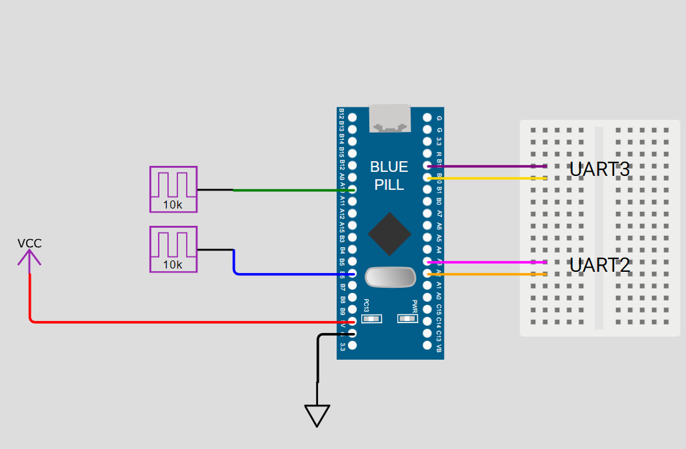

# STM32 Blue Pill Pulse Counter (PA10 + PB6) with UART2 + UART3 Output

This project counts **rising edge pulses** on two input pins of an **STM32F103C8T6 (Blue Pill)** board:

- **PA10** (Input 1)
- **PB6**  (Input 2)

Every **1 second**, the counts are sent to:

- **UART2** (PA2 TX, PA3 RX)
- **UART3** (PB10 TX, PB11 RX)

This code is designed for **PlatformIO** and works without FreeRTOS.

---

## Features

- Counts pulses using **fast GPIO polling** (register read)
- Supports **two independent pulse inputs**
- Sends results to **two UART ports**
- Works with **PlatformIO + STM32 HAL**
- Suitable for RPM measurement (ex: 5000 RPM)

---

## Output Format

Every 1 second:

---

## Hardware Requirements

- STM32F103C8T6 Blue Pill board
- 2 pulse sources (Hall sensor / encoder / pulse generator)
- 2 USB-TTL converters (3.3V recommended)
- Optional: 10k pulldown resistors (recommended)

---

## Wiring

### Pulse Inputs
| Signal | STM32 Pin |
|--------|----------|
| Pulse Input 1 | PA10 |
| Pulse Input 2 | PB6 |
| Sensor Ground | GND |

**Recommended pulldown:**  
- 10k resistor from PA10 to GND  
- 10k resistor from PB6 to GND  

---

## Circuit Diagram

---

### UART3 Connection (PB10 / PB11)
| Blue Pill | USB-TTL |
|----------|---------|
| PB10 (TX3) | RXD |
| PB11 (RX3) | TXD |
| GND | GND |
| 3.3V (optional) | VCC |

---

### UART2 Connection (PA2 / PA3)
| Blue Pill | USB-TTL |
|----------|---------|
| PA2 (TX2) | RXD |
| PA3 (RX2) | TXD |
| GND | GND |
| 3.3V (optional) | VCC |

⚠️ **Always connect GND between Blue Pill and USB-TTL.**

---

## Important Notes

- Input signals should be **3.3V logic**.
- If your sensor output is **5V**, use a voltage divider or level shifter.
- This method is reliable for moderate speeds (RPM counting, hall sensors, encoders).

---

## Software Setup (PlatformIO)

### 1. Install PlatformIO
Install PlatformIO extension in VS Code.

### 2. Clone Project

    git clone https://github.com/yourusername/yourrepo.git
    cd yourrepo

### 3. Build and Upload

    pio run
    pio run --target upload

Serial Monitor / UART2 Monitor

    pio device monitor -b 115200

Or use any serial terminal software (Putty, TeraTerm, Arduino Serial Monitor)

---
## Pin Summary

Function	STM32 Pin

Input 1 (Pulse Count)	PA10

Input 2 (Pulse Count)	PB6

UART2 TX	PA2

UART2 RX	PA3

UART3 TX	PB10

UART3 RX	PB11

---

## License

This project is open-source. Use and modify freely.

